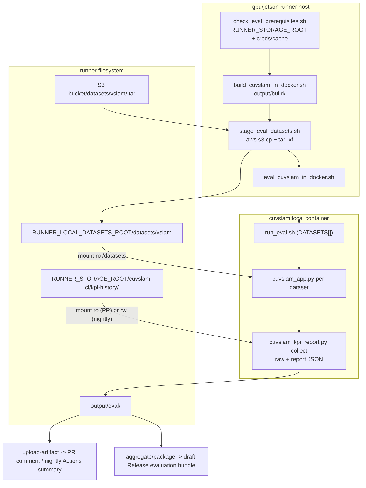

# cuVSLAM CI/CD Reference

Architecture, configuration, and constraints for the CI/CD pipelines. Task
playbooks are in [SKILL.md](SKILL.md).

## Goals

- Catch tracking-accuracy regressions on every PR (x86 eval) and track per-config KPI drift over time in nightly.
- Keep benchmark datasets private while the conversion scripts stay public: dataset blobs live in S3 and only provisioning writes them.
- Keep the runner footprint minimal: runners need Docker and the GPU runtime; all host tooling (AWS CLI, Python, pre-commit, jq) comes from the `cuvslam-ci:local` image built per job.

## Pipelines

- `pr-verify.yml`: lint in the CI image, then build + unit test on x86 (fork-gated), Orin, and Thor. The x86 job stages datasets, runs eval, and posts a KPI table to the PR comment. A status job aggregates the required checks.
- `nightly.yml`: build + test matrix across four x86 CUDA/Ubuntu configs plus Orin and Thor. The four x86 configs run eval (`eval: true`) and generate KPI data and PDF reports. Scheduled and ordinary manual runs retain versioned Actions artifacts but never create a Release. A successful manual dispatch from a matching `release/vX.Y.Z` branch promotes the same consumer artifacts to an unpublished draft Release.
- `provision-datasets.yml`: manual `workflow_dispatch`, gated to the default branch. Builds the CI image, runs `provision_dataset.sh` for the chosen dataset, uploads `<name>.tar`. The only writer of dataset storage.
- `sync-rulesets.yml`: applies `.github/rulesets/default-branch-ruleset.json` through the GitHub API using `RULESET_ADMIN_TOKEN`, on push to the ruleset path, weekly, and on demand.

## Eval data flow

## Secrets and variables

Repository variables:

- `S3_DATASETS_BUCKET` - dataset tarball prefix, kept out of source so the public repo does not expose the bucket.
- `AWS_DEFAULT_REGION`.
- `AWS_CLI_PUBLIC_KEY` - PGP public key block; the CI image GPG-verifies the AWS CLI installer against it at build time.
- `RUNNER_STORAGE_ROOT` - root of the runner storage mount; KPI history is at `<root>/cuvslam-ci/kpi-history`.
- `RUNNER_LOCAL_DATASETS_ROOT` (optional) - local extract root; default `$HOME/.cache/cuvslam`.

Repository secrets, split read from write so fork-reachable jobs never hold a key that can overwrite datasets:

- `AWS_S3_RO_ACCESS_KEY_ID` / `AWS_S3_RO_SECRET_ACCESS_KEY` - read-only S3; eval staging in `pr-verify.yml` and `nightly.yml`. Passed as `AWS_ACCESS_KEY_ID` / `AWS_SECRET_ACCESS_KEY`.
- `AWS_S3_ACCESS_KEY_ID` / `AWS_S3_SECRET_ACCESS_KEY` - read-write S3; `provision-datasets.yml` only.
- `RULESET_ADMIN_TOKEN` - used by `sync-rulesets.yml` to apply branch rulesets.

## Dataset registry and layout

- `PROVISIONABLE_DATASETS` (datasets the Provision workflow can build) and `EVAL_DATASET_NAMES` (datasets eval stages) live in `datasets_config.sh`.
- `run_eval.sh` `DATASETS[]` records are pipe-delimited: `LABEL|link_name|subdir|test_config|app_flags`. KITTI and
  EuRoC are active; the others are commented until provisioned.
- Tarball: uncompressed `<name>.tar` at `<S3_DATASETS_BUCKET>/<name>.tar`. Staged to `<RUNNER_LOCAL_DATASETS_ROOT>/datasets/vslam/<name>/` and mounted read-only into the eval container at `/datasets`. An ETag file skips re-download when the cache is current.

## KPI outputs

- Per run: `kpi_<run_id>.json` contains the flat current values used for rolling history;
  `kpi_<run_id>.report.json` contains the current values, previous per-config values, and soft drift results. KPIs are
  ATE, ARE, Kabsch, tracking losts, and FPS, in ODOM and SLAM modes. During migration, `run_eval.sh` also emits the old
  `.table` and `.drift` files; a follow-up script-only change removes those after CI switches to report JSON.
- Nightly: `cuvslam_kpi_report.py aggregate` publishes one row per dataset/type/mode. KPI cells contain the mean and
  population standard deviation across all four x86 configurations; diff cells compare current and previous
  aggregated means. Temporary per-config `eval-kpis-staging-<version>-<slug>` and
  `eval-reports-staging-<version>-<slug>` artifacts, raw per-config JSON, reports, and history remain namespaced by
  `platform-cuda-ubuntu`. `RUN_ID` is the UTC date. After aggregation, staging artifacts are replaced by
  `cuvslam-evaluation-<version>.tar.gz`.
- Release dispatch: `release/vX.Y[.Z][-suffix]` derives tag `vX.Y[.Z][-suffix]` after validating it against `VERSION`. The draft Release contains the consumer artifacts and `cuvslam-evaluation-<version>.tar.gz` generated by the same run. Existing drafts, published Releases, and tags are never overwritten.
- PR: `cuvslam_kpi_report.py render` produces a single table labeled with `EVAL_CONFIG`; `RUN_ID=pr-<number>`; the
  matching config's KPI history is mounted read-only, so PR runs never write the baseline.

## Nightly artifacts and releases

- `VERSION` is the single package-version source for scheduled, manual, and release runs. Release dispatch additionally requires the `release/vX.Y.Z` branch name to match `VERSION`.
- The runtime library version is generated separately as `MAJOR.MINOR.PATCH+<short-git-sha>[-modified]`. Nightly
  requires a clean tracked source tree and verifies that every wheel identifies the checked-out SHA without the
  `-modified` suffix.
- Final distributables are packaged once by their producing job and uploaded directly, without an Actions ZIP wrapper: `cuvslam-cpp-<version>-<slug>.tar.gz`, the versioned Python wheels, `cuvslam-docs-<version>.tar.gz`, and `cuvslam-evaluation-<version>.tar.gz`.
- Each C++ archive contains only `bin/{libcuvslam.so,cuvslam_api_launcher}`, `include/cuvslam/{cuvslam2.h,cuvslam_gpu.h,ground_constraint2.h}`, and `LICENSE`. `scripts/package_cpp_dist.sh` creates and validates this manifest.
- A release job downloads the `cuvslam-*` distributables and promotes the same bytes to the draft Release. Test-result artifacts remain Actions-only.
- The Actions summary contains CI test and KPI status. Release notes are generated separately from the evaluation summary, so permanent releases do not contain run metadata or expiring Actions links.

## Constraints

- Fork isolation: eval and dataset steps run only where `head.repo == github.repository`. Fork code never reaches dataset runners.
- Credential split: eval steps pass the read-only `AWS_S3_RO_*` pair; only provisioning uses the read-write `AWS_S3_*` pair.
- Per-config namespacing: KPI history directories and eval artifact names carry the `platform-cuda-ubuntu` slug. Artifact names are immutable in `upload-artifact@v7`, so a multi-config run requires per-config names to avoid an upload collision, and per-config history directories keep each config's diff-vs-previous lineage correct.
- Direct distributable uploads: `upload-artifact@v7` uses `archive: false` only for single-file C++ archives, wheels, documentation, and the evaluation record. Multi-file diagnostics retain the default ZIP container.
- Release safety: only manual dispatches from validated `release/*` branches can publish, and they create drafts. Scheduled runs have no `contents: write` permission. Rebuilding requires explicit deletion of the previous draft; published Releases and existing tags are never moved or replaced.
- Uncompressed `.tar`: gzip was dropped to cap memory on the provisioning runner. Packing (`provision_dataset.sh`) and extraction (`stage_eval_datasets.sh`) stay gzip-free and consistent.
- KPI history publish uses a direct copy: the S3-backed history mount does not implement `rename(2)`, so `run_eval.sh` copies the KPI JSON straight to the target rather than staging to `.tmp` and `mv`.
- Fail-fast on `RUNNER_STORAGE_ROOT`: the nightly eval step errors if it is unset rather than building a filesystem-root path; `check_eval_prerequisites.sh` also requires it.
- Runner requirements: every eval-enabled runner needs the `RUNNER_STORAGE_ROOT` mount and configured repository secrets/variables. The AWS CLI and `check_eval_prerequisites.sh` run in the CI tools image and read the mounted storage and credentials there.
- Version provenance: `scripts/Dockerfile` keeps `git-lfs` filters configured system-wide because nightly materializes
  LFS files before mounting the source read-only into the product build container. Runner-specific build configuration
  must use Docker build arguments rather than rewriting tracked source files.
- Change isolation: ruleset, CODEOWNERS, and `.github/workflows/**` changes go in their own MR, enforced by the `isolated-ruleset-change` pre-commit hook. Use the `[infra]` MR prefix.

## Learnings

- Thor has surfaced a GitHub runner-agent `set_output` / node24 failure during checkout, independent of this wiring; watch the first Thor eval run.
- `EVAL_CONFIG` in `pr-verify.yml` is a static label matching the build script defaults (CUDA 12.6.3 / Ubuntu 24.04). Update it if those defaults change, or pin the PR build's `CUDA_VERSION` / `UBUNTU_VERSION` so the label cannot drift.
- The AWS CLI and the scripts read `AWS_ACCESS_KEY_ID` / `AWS_SECRET_ACCESS_KEY` (standard names). The `AWS_S3_*` strings in script error messages name the repository secrets to configure, not env vars the scripts read.
- Git LFS materializes pointer files as their binary contents. A build container without the LFS clean filter reports
  those files as modified even when the checkout is clean, causing `get_version()` to gain `-modified`.
