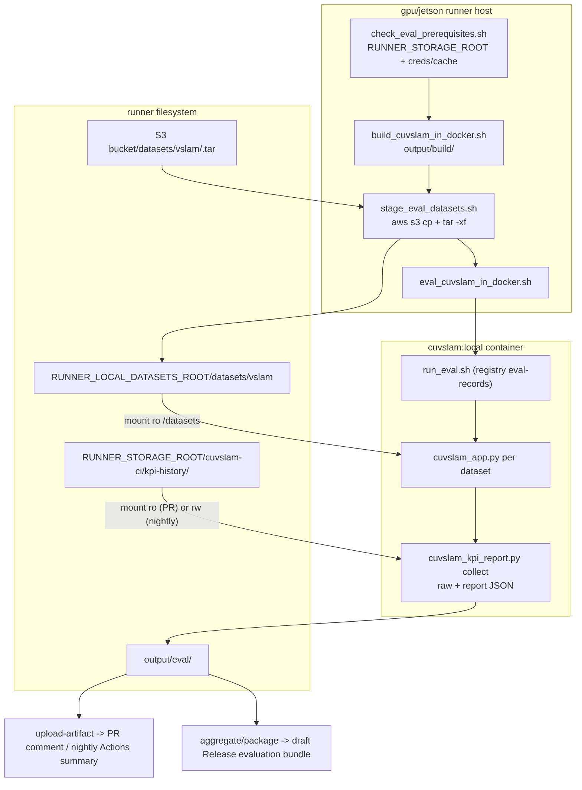

# cuVSLAM CI/CD Reference

Architecture, configuration, and constraints for the CI/CD pipelines. Task
playbooks are in [SKILL.md](SKILL.md).

## Goals

- Catch tracking-accuracy regressions on every PR (x86 eval) and track per-config KPI drift over time in nightly.
- Keep benchmark datasets private while the conversion scripts stay public: dataset blobs live in S3 and only provisioning writes them.
- Keep the runner footprint minimal: runners need Docker and the GPU runtime; all host tooling (AWS CLI, Python, pre-commit, jq) comes from the `cuvslam-ci:local` image built per job.

## Pipelines

- `pr-verify.yml`: lint in the CI image, then build + unit test on x86 (fork-gated), Orin, and Thor. The x86 job stages datasets, runs eval, and posts a KPI table to the PR comment. A status job aggregates the required checks.
- `nightly.yml`: build + test matrix across four x86 CUDA/Ubuntu configs plus Orin and Thor. The four x86 configs run eval (`eval: true`) and generate KPI data and PDF reports; Orin and Thor run CUDA micro-benchmarks (`benchmark: true`) and generate structured speed reports. Scheduled and ordinary manual runs retain versioned Actions artifacts but never create a Release. A successful manual dispatch from a matching `release/vX.Y.Z` branch promotes the same consumer artifacts to an unpublished draft Release.
- `provision-datasets.yml`: manual `workflow_dispatch`, gated to the default branch. Builds the CI image, runs `provision_dataset.sh` for the chosen dataset, uploads `<name>.tar`. The only writer of dataset storage.
Branch protection is not part of this repository. The default-branch ruleset is configured in the
GitHub UI, so nothing here applies or verifies it; read the live rules with
`gh api repos/<owner>/<repo>/rules/branches/main`.

## Eval data flow

```mermaid
flowchart TD
  subgraph host [gpu/jetson runner host]
    prereq["check_eval_prerequisites.sh\nRUNNER_STORAGE_ROOT + creds/cache"]
    build["build_cuvslam_in_docker.sh\noutput/build/"]
    stage["stage_eval_datasets.sh\naws s3 cp + tar -xf"]
    wrapper["eval_cuvslam_in_docker.sh"]
    prereq --> build --> stage --> wrapper
  end
  subgraph container [cuvslam:local container]
    inner["run_eval.sh (registry eval-records)"]
    app["cuvslam_app.py per dataset"]
    kpi["cuvslam_kpi_report.py collect\nraw + report JSON"]
    inner --> app --> kpi
  end
  subgraph fs [runner filesystem]
    s3["S3 bucket/datasets/vslam/<name>.tar"]
    cache["RUNNER_LOCAL_DATASETS_ROOT/datasets/vslam"]
    history["RUNNER_STORAGE_ROOT/cuvslam-ci/kpi-history/<slug>"]
    out["output/eval/"]
  end
  s3 --> stage --> cache
  wrapper --> inner
  cache -->|"mount ro /datasets"| app
  history -->|"mount ro (PR) or rw (nightly)"| kpi
  kpi --> out
  out --> pub["upload-artifact -> PR comment / nightly Actions summary"]
  out --> release["aggregate/package -> draft Release evaluation bundle"]
```

## Secrets and variables

Repository variables:

- `S3_DATASETS_BUCKET` - dataset tarball prefix, kept out of source so the public repo does not expose the bucket.
- `AWS_DEFAULT_REGION`.
- `AWS_CLI_PUBLIC_KEY` - PGP public key block; the CI image GPG-verifies the AWS CLI installer against it at build time.
- `RUNNER_STORAGE_ROOT` - root of the runner storage mount; KPI history is at `<root>/cuvslam-ci/kpi-history`.
- `RUNNER_LOCAL_DATASETS_ROOT` (optional) - local extract root; default `$HOME/.cache/cuvslam`.

Repository secrets, split read from write so fork-reachable jobs never hold a key that can overwrite datasets:

- `AWS_S3_RO_ACCESS_KEY_ID` / `AWS_S3_RO_SECRET_ACCESS_KEY` - read-only S3; eval staging in `pr-verify.yml` and `nightly.yml`. Passed as `AWS_ACCESS_KEY_ID` / `AWS_SECRET_ACCESS_KEY`.
- `AWS_S3_ACCESS_KEY_ID` / `AWS_S3_SECRET_ACCESS_KEY` - read-write S3; `provision-datasets.yml` only.

## Dataset registry and layout

- `DATASETS` in `tools/python_tools/cuvslam_tools/dataset_registry.py` is the single source of truth. A `DatasetSpec` holds the ID, the preparation module, and its `EvalSpec` records; an `EvalSpec` holds the reporter config filename, the `cuvslam_app` flags, suite membership, and gating. Provisionable means the dataset is present; eval-enabled means it has at least one `EvalSpec`. KITTI, EuRoC, TUM, ICL-NUIM and M3ED-SPOT are eval-enabled; `tartan`, `tartanair_v1` and `coda` are provisionable only. `tartanair_v1` rebuilds the OSMO TartanAir evaluation from the public V1 Hard release: `download_tartanair_v1.sh` fetches left and right images and left depth for 16 environments and accepts each zip only if it matches the size and MD5 pinned in `zipfiles.txt`, and the converter ships three reporter configs: `tartan-vo_slam.cfg` (`TARTAN`) with every trajectory, and the OSMO split into `tartan_stable-vo_slam.cfg` (`TARTAN_STABLE`, OSMO's `TARTAN`) and `tartan_flaky-vo_slam.cfg` (`TARTAN_FLAKY`). All three ship in the tarball, so choosing between them is a registry change. Smoke runs KITTI, EuRoC and ICL-NUIM, which covers stereo, stereo-inertial and RGB-D; TUM is full-only because it is the larger RGB-D corpus and ICL-NUIM already covers the modality pre-merge, and M3ED-SPOT is full-only because at 56 GiB and 57k frames in two modes it is the most expensive record in the suite.
- One dataset can carry several records. KITTI, TUM and ICL-NUIM each have a second, full-only `informational` record that replays the same reporter config in `multisensor` mode, so the `MSF` KPI rows compare the cuNLS solver against the default one on identical frames. EuRoC and M3ED-SPOT have none: the cuNLS solver projects through a pinhole camera and only warns on the fisheye and polynomial models those two use, so a record there would report numbers computed from the wrong geometry. `multisensor` needs `USE_CUNLS=ON`, which every CI configuration has.
- The module is standard library only and imports converters lazily, so shell wrappers call it with `PYTHONPATH=tools/python_tools` inside `cuvslam-ci:local` before anything is installed. `datasets_config.sh` wraps it as `dataset_registry`; `run_eval.sh` defines its own shim because the S3 variables `datasets_config.sh` requires are absent in the eval container.
- Subcommands: `validate [--dataset] [--suite]`, `list [--eval] [--suite]`, `eval-records [--suite]` (tab-separated `id`, KPI prefix, config path, flags), `kpi-keys [--suite]`, `prepare-module`, `prepare --root-file`, `verify-staged --root`.
- Suites: `EVAL_SUITE` selects records in `stage_eval_datasets.sh`, `check_eval_prerequisites.sh`, and `run_eval.sh`, and `eval_cuvslam_in_docker.sh` forwards it into the container. Unset means every record; validation requires every `EvalSpec` to belong to `full`, so unset and `full` agree. `validate --suite` additionally rejects a suite that would select nothing.
- `kpi-keys --suite` prints the `<PREFIX>_<METRIC>_<TYPE>_<MODE>` keys a suite can produce, so a consumer can tell a key that is legitimately absent from one that went missing. It lists both `ODOM` and `SLAM` for every record because which of the two a run emits depends on `sequence_title` inside the reporter config, which ships in the tarball. `KPI_METRICS` and `ODOMETRY_MODE_TYPES` in the registry mirror `REQUIRED_METRICS` and `odometry_mode_to_type` in `scripts/cuvslam_kpi_report.py` and have to be edited together. `run_eval.sh` passes the `kpi-keys` output to `cuvslam_kpi_report.py collect -e`, so a mismatch shows up as MISSING rows in the drift check.
- Derived, never declared: `<id>.tar`, the staged directory, the `/sequences` mount, and the KPI prefix (first hyphen-delimited token of the config filename, upper-cased). Validation rejects two records that derive the same prefix and `--odometry_mode`.
- The reporter writes to `$CUVSLAM_OUTPUT/<config stem>-<odometry mode>/<timestamp>/`. The mode is part of the directory because the KPI collector reads only the newest run under each directory, so two records sharing one config would otherwise overwrite each other; the prefix is unaffected because it is the first hyphen-delimited token. KPI types are `MCAM`, `MONO`, `VIO`, `RGBD` and `MSF`, one per odometry mode, and an unrecognized mode is rejected rather than filed under another mode's keys.
- Tarball: uncompressed `<id>.tar` at `<S3_DATASETS_BUCKET>/<id>.tar`, whose root is the directory `prepare()` returned. Staged to `<RUNNER_LOCAL_DATASETS_ROOT>/datasets/vslam/<id>/` and mounted read-only into the eval container at `/datasets`. An ETag file skips re-download when the cache is current. After extraction, `verify-staged` checks the shipped config's `dataset_folder` equals `<id>/`.

## KPI outputs

- Per run: `kpi_<run_id>.json` contains the flat current values used for rolling history;
  `kpi_<run_id>.report.json` contains the current values, previous per-config values, and soft drift results. KPIs are
  ATE, ARE, Kabsch, tracking losts, and FPS, in ODOM and SLAM modes. During migration, `run_eval.sh` also emits the old
  `.table` and `.drift` files; a follow-up script-only change removes those after CI switches to report JSON.
- KPI config: `kpi_baseline_ranges.json` has `defaults` and per-prefix `datasets` overrides, each holding the
  sequence checks (`max_ate_pct`, `max_lost_frame_pct`, `exclude_failed`), the rolling-baseline settings, and per-metric drift `tolerances`; a
  dataset also holds calibrated `expected` values keyed `<METRIC>_<TYPE>_<MODE>`. A malformed file raises, because
  the sequence checks change KPI values.
- Rolling-baseline check: `collect -H` reads the last `baseline_window` `kpi_<run>.json` files from the config's
  KPI history (skipping the current run's) and stores each key's series in the report's `baseline` block. `render`
  and `aggregate` list KPIs worse than the series median by more than max(`baseline_mad_k` × MAD,
  `baseline_min_pct` % of the median), in the worse direction only (FPS down, the rest up), needing at least 3 runs.
  The nightly aggregate first averages each history run across the configurations, so its band reflects the noise of
  the aggregated mean. PR runs compare against `main`'s nightly history for `EVAL_CONFIG`. It never fails the job, and
  a manually dispatched nightly writes into the history like a scheduled one.
- Drift check: covers every key the registry's `kpi-keys` lists for the suite, plus any calibrated key. The tolerance
  is the calibrated entry's own (`{"value": ..., "tol_pct"|"tol_abs": ...}`), else the dataset's for that metric,
  else the default's. Uncalibrated keys are SKIPPED.
- Sequence checks: `collect` also records each sequence run in the report JSON's `sequences` block and marks it failed
  if it tracked no frames, lost more than `max_lost_frame_pct` of its frames, has no ATE, or exceeds `max_ate_pct`
  (RGB-D datasets get a laxer ATE cap). Failures never fail the job. Prefixes with `exclude_failed` leave failed
  sequences out of the ATE, ARE and Kabsch means (TUM and TartanAir); Losts and FPS always cover every sequence.
- Nightly: `cuvslam_kpi_report.py aggregate` publishes one row per dataset/type/mode. KPI cells contain the mean and
  population standard deviation across all four x86 configurations, except Losts, which shows min–max; diff cells
  compare current and previous aggregated means. The last column counts broken sequences (failed in every
  configuration) and flaky ones (failed in some), listed under a collapsed "Failed sequences" section.
  `aggregate --values-only` drops the diffs and the broken/flaky data for release notes. Temporary per-config `eval-kpis-staging-<version>-<slug>` and
  `eval-reports-staging-<version>-<slug>` artifacts, raw per-config JSON, reports, and history remain namespaced by
  `platform-cuda-ubuntu`. `RUN_ID` is the UTC date. After aggregation, staging artifacts are replaced by
  `cuvslam-evaluation-<version>.tar.gz`.
- Release dispatch: `release/vX.Y[.Z][-suffix]` derives tag `vX.Y[.Z][-suffix]` after validating it against `VERSION`. The draft Release contains the consumer artifacts and `cuvslam-evaluation-<version>.tar.gz` generated by the same run. Existing drafts, published Releases, and tags are never overwritten.
- PR: `cuvslam_kpi_report.py render` produces a single table labeled with `EVAL_CONFIG`, with a Failed column counting
  that run's failed sequences; `RUN_ID=pr-<number>`; the
  matching config's KPI history is mounted read-only, so PR runs never write the baseline.

## Jetson benchmark outputs

- The regular C++ test command excludes names containing `SpeedUp` or `Speedup`. Nightly matrix entries flagged
  `benchmark: true` run the active matching cases from `cuda_modules_test` separately. Tests prefixed with
  `DISABLED_` remain excluded.
- `cuvslam_benchmark_report.py metadata` records host Jetson/JetPack, CUDA, Ubuntu, power-mode, clock, commit, and
  kernel metadata. `benchmark_cuvslam_in_docker.sh` runs the registered `cuda_modules_test` through CTest with a fixed
  GTest seed and writes raw output plus GoogleTest XML.
- Each active speed test records `iterations`, `cpu_ns_per_iteration`, `gpu_ns_per_iteration`, and `speedup` as
  GoogleTest XML properties. `cuvslam_benchmark_report.py render` validates those properties and writes
  `cpp-benchmark-results.json` and `benchmark-summary.md`.
- Per-config staging artifacts use
  `benchmark-results-staging-<version>-<platform>-cuda<version>-ubuntu<version>`. The nightly summary publishes the
  Orin and Thor tables independently, then retains `benchmark-results-<version>` for 30 days.
- Benchmark test failures are informational during the initial soak period. Missing tests, malformed metrics, or a
  missing Orin/Thor report fail summary consolidation because they indicate broken benchmark coverage.
- Jetson benchmarks do not run on PRs and are CI diagnostics, not release assets. They are not added to
  `cuvslam-evaluation-<version>.tar.gz`.

## Nightly artifacts and releases

- `VERSION` is the single package-version source for scheduled, manual, and release runs. Release dispatch additionally requires the `release/vX.Y.Z` branch name to match `VERSION`.
- The runtime library version is generated separately as `MAJOR.MINOR.PATCH+<short-git-sha>[-modified]`. Nightly
  requires a clean tracked source tree and verifies that every wheel identifies the checked-out SHA without the
  `-modified` suffix.
- Final distributables are packaged once by their producing job and uploaded directly, without an Actions ZIP wrapper: `cuvslam-cpp-<version>-<slug>.tar.gz`, the versioned Python wheels, `cuvslam-docs-<version>.tar.gz`, and `cuvslam-evaluation-<version>.tar.gz`.
- Each C++ archive contains only `bin/{libcuvslam.so,cuvslam_api_launcher}`, `include/cuvslam/{cuvslam2.h,cuvslam_gpu.h,ground_constraint2.h}`, and `LICENSE`. `scripts/package_cpp_dist.sh` creates and validates this manifest.
- A release job downloads the `cuvslam-*` distributables and promotes the same bytes to the draft Release. Test-result artifacts remain Actions-only.
- The Actions summary contains CI test and KPI status. Release notes are generated separately from the evaluation summary, so permanent releases do not contain run metadata or expiring Actions links.

## Constraints

- Fork isolation: eval and dataset steps run only where `head.repo == github.repository`. Fork code never reaches dataset runners.
- Credential split: eval steps pass the read-only `AWS_S3_RO_*` pair; only provisioning uses the read-write `AWS_S3_*` pair.
- Per-config namespacing: KPI history directories and eval artifact names carry the `platform-cuda-ubuntu` slug. Artifact names are immutable in `upload-artifact@v7`, so a multi-config run requires per-config names to avoid an upload collision, and per-config history directories keep each config's diff-vs-previous lineage correct.
- Benchmark namespacing: Orin and Thor benchmark artifacts carry the same full config slug. Their absolute timings and
  speedups are not aggregated because the devices use different SoCs, CUDA versions, and JetPack releases.
- Direct distributable uploads: `upload-artifact@v7` uses `archive: false` only for single-file C++ archives, wheels, documentation, and the evaluation record. Multi-file diagnostics retain the default ZIP container.
- Release safety: only manual dispatches from validated `release/*` branches can publish, and they create drafts. Scheduled runs have no `contents: write` permission. Rebuilding requires explicit deletion of the previous draft; published Releases and existing tags are never moved or replaced.
- Uncompressed `.tar`: gzip was dropped to cap memory on the provisioning runner. Packing (`provision_dataset.sh`) and extraction (`stage_eval_datasets.sh`) stay gzip-free and consistent.
- KPI history publish uses a direct copy: the S3-backed history mount does not implement `rename(2)`, so `run_eval.sh` copies the KPI JSON straight to the target rather than staging to `.tmp` and `mv`.
- Fail-fast on `RUNNER_STORAGE_ROOT`: the nightly eval step errors if it is unset rather than building a filesystem-root path; `check_eval_prerequisites.sh` also requires it.
- Runner requirements: every eval-enabled runner needs the `RUNNER_STORAGE_ROOT` mount and configured repository secrets/variables. The AWS CLI and `check_eval_prerequisites.sh` run in the CI tools image and read the mounted storage and credentials there.
- Version provenance: `scripts/Dockerfile` keeps `git-lfs` filters configured system-wide because nightly materializes
  LFS files before mounting the source read-only into the product build container. Runner-specific build configuration
  must use Docker build arguments rather than rewriting tracked source files.
- Change isolation: CODEOWNERS and CI workflow changes go in their own MR, enforced by the `isolated-ruleset-change` pre-commit hook and re-run as `isolated-ruleset-change-ci` in the `Lint` job. `PROTECTED_REGEX` in `scripts/check-isolated-ruleset-change.sh` is the authority on which paths qualify; it is narrower than `.github/workflows/**`. Use the `[infra]` MR prefix.
- Branch protection is UI-only: no file in this repository describes the default-branch ruleset, so a
  change here can never be reviewed as code and drift cannot be detected by CI. Verify what is
  enforced with `gh api repos/<owner>/<repo>/rules/branches/main` rather than trusting any document.

## Learnings

- Thor has surfaced a GitHub runner-agent `set_output` / node24 failure during checkout, independent of this wiring; watch the first Thor eval run.
- `EVAL_CONFIG` in `pr-verify.yml` is a static label matching the build script defaults (CUDA 12.6.3 / Ubuntu 24.04). Update it if those defaults change, or pin the PR build's `CUDA_VERSION` / `UBUNTU_VERSION` so the label cannot drift.
- The AWS CLI and the scripts read `AWS_ACCESS_KEY_ID` / `AWS_SECRET_ACCESS_KEY` (standard names). The `AWS_S3_*` strings in script error messages name the repository secrets to configure, not env vars the scripts read.
- Git LFS materializes pointer files as their binary contents. A build container without the LFS clean filter reports
  those files as modified even when the checkout is clean, causing `get_version()` to gain `-modified`.
