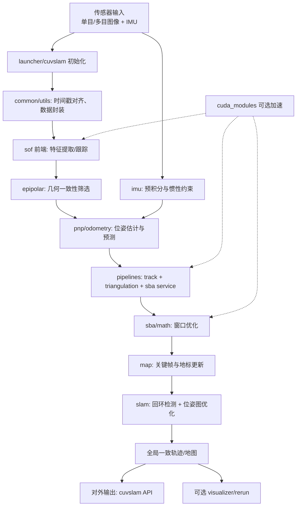
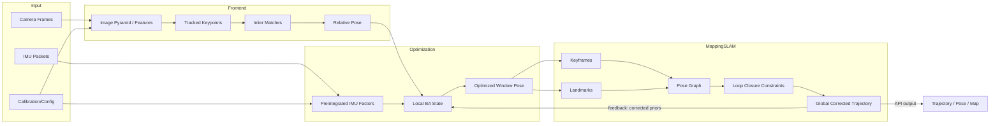

# cuVSLAM `libs/` 模块分析

本文基于 `libs/` 下各模块的 `CMakeLists.txt`、头文件命名及模块依赖关系，对模块职责进行结构化梳理，便于快速理解工程架构。

## 1. `libs/` 总体结构

`libs/CMakeLists.txt` 将 `libs` 组织为一组可组合的静态库（部分模块受编译选项控制），并由 `cuvslam` 顶层库进行汇总链接。主要可分为：

- **基础层**：`common`、`log`、`profiler`、`testing`、`utils`
- **几何与优化层**：`math`、`epipolar`、`pnp`、`sba`、`refinement`
- **感知与跟踪层**：`camera`、`sof`、`cuda_modules`
- **状态估计与建图层**：`imu`、`pipelines`、`odometry`、`map`、`slam`
- **系统集成层**：`launcher`、`camera_rig_edex`、`edex`、`cuvslam`、`visualizer`

> 条件编译模块：`cuda_modules`（`USE_CUDA`）、`refinement`（`USE_CERES`）、`visualizer`（`USE_RERUN`）。

---

## 2. 各模块作用说明

| 模块 | 主要作用 | 关键线索（文件） | 主要依赖（从 CMake） |
|---|---|---|---|
| `camera` | 定义相机模型、观测与相机 rig 结构，是视觉几何的输入抽象层。 | `camera.h`、`observation.h`、`rig.h` | `common` |
| `camera_rig_edex` | 将多相机 rig 配置与 EDEX 数据组织结合，提供重复/穿梭式 rig 管理及滤波。 | `camera_rig_edex.h`、`repeated_camera_rig_edex.h`、`shuttle_camera_rig_edex.h` | `camera`、`common`、`edex`、`utils` |
| `common` | 全局公共基础设施：时间、坐标系、图像容器、IMU基础数据结构、线程工具、错误与日志类型等。 | `time.h`、`coordinate_system.h`、`image.h`、`imu_measurement.h`、`thread_safe_queue.h` | `Eigen` 等基础依赖 |
| `cuda_modules` | CUDA 加速算子与核函数封装，覆盖特征提取、金字塔、跟踪、SBA、卷积等。 | `gftt.h`、`lk_tracker.h`、`sba.h`、`cuda_kernels/*.cu` | `camera`、`common`、`cuvslam_math`、`profiler` |
| `cuvslam` | 顶层聚合库，对外暴露核心 API，并汇总各子模块功能（含版本信息生成）。 | `cuvslam2.h`、`cuvslam_gpu.h`、`ground_constraint2.h` | `slam`、`odometry`、`pipelines`、`map`、`imu` 等 |
| `edex` | EDEX 数据与时间线相关工具，负责数据输入组织与内部类型定义。 | `edex.h`、`edex_types.h`、`timeline.h` | `common`、`jsoncpp` |
| `epipolar` | 双视图/多视图极几何工具集：基础矩阵、单应矩阵、重建与 RANSAC。 | `fundamental_matrix_utils.h`、`homography*.h`、`point_reconstruction.h` | `common`、`cuvslam_math` |
| `imu` | IMU预积分、惯导优化、惯性 SBA 与相关线性代数模块（含可选 GPU 版本）。 | `imu_preintegration.h`、`inertial_optimization.h`、`imu_sba*.h` | `camera`、`common`、`cuvslam_math`、`profiler` |
| `launcher` | 系统启动与模式装配层，封装单目/多目/视惯等运行入口与创建逻辑。 | `launcher_create.h`、`monocular_launcher.h`、`visual_inertial_launcher.h` | `slam`、`sof`、`odometry` 等 |
| `log` | 统一日志接口与实现（含 `spdlog` 适配），为各模块提供日志能力。 | `logger_interface.h`、`spdlog_logger.cpp` | `common`、`spdlog` |
| `map` | 局部地图数据结构与服务层：关键帧、landmark、地图管理与访问。 | `keyframe.h`、`map.h`、`service.h` | `camera`、`common`、`imu`、`profiler` |
| `math` (`cuvslam_math`) | 几何优化与通用数学工具：PGO、RANSAC、鲁棒代价、位姿参数化等。 | `pgo.h`、`ransac.h`、`twist.h`、`robust_cost_function.h` | `common` |
| `odometry` | 视觉/视惯里程计层，含单目、多目、立体惯导（可选 RGBD）里程计与位姿预测。 | `mono_visual_odometry.h`、`multi_visual_odometry.h`、`stereo_inertial_odometry.h` | `camera`、`imu`、`map`、`pipelines`、`sof` |
| `pipelines` | 在线跟踪与三角化流水线，连接特征、PnP、SBA、地图更新，形成运行主干。 | `track_online_*.h`、`triangulator.h`、`service_sba.h` | `epipolar`、`pnp`、`sba`、`map`、`imu` |
| `pnp` | 位姿求解模块，提供单目/多相机 PnP，CUDA 下支持视觉 ICP 扩展。 | `mono_pnp.h`、`multicam_pnp.h`、`visual_icp.h` | `camera`、`epipolar`、`cuvslam_math` |
| `profiler` | 性能分析抽象层，支持 NVTX（启用时）并向上层提供统一埋点接口。 | `profiler.h`、`profiler_enable.h` | `NVTX`（可选） |
| `refinement` | 以代价函数和损失函数为核心的精化优化模块（典型用于 BA 细化）。 | `cost_pinhole.h`、`cost_rational_polynomial.h`、`refinement.h` | `common` |
| `sba` | 稀疏 BA 求解模块，提供 CPU Schur 补实现与可选 GPU 实现。 | `mono_sba_solver.h`、`schur_complement_bundler_*.h` | `camera`、`epipolar`、`cuvslam_math` |
| `slam` | 高层 SLAM 引擎：异步 SLAM/定位、位姿图、回环求解、地图数据库与可视图层。 | `async_slam.h`、`pose_graph.h`、`lcs_*.h`、`slam.h` | `camera`、`pnp`、`epipolar`、`log` |
| `sof` | 前端视觉跟踪（Structure from Optical Flow）模块：特征检测、跟踪、筛选与配置。 | `gftt.h`、`lk_tracker.h`、`selector_*.h`、`sof_create.h` | `camera`、`epipolar`、`profiler` |
| `testing` | 测试基础设施模块，提供统一测试主程序与测试依赖。 | `testing_main.cpp` | `common`、`gtest`、`gflags` |
| `utils` | 图像 IO/加载/转换等工具模块，负责工程外围实用功能。 | `image_io.h`、`image_loader.h`、`image_transform.h` | `common`、`jpeg/png/json` |
| `visualizer` | 基于 Rerun 的可视化模块，为调试与在线观测提供可视化输出。 | `visualizer.hpp` | `camera`、`common`、`rerun` |

---

## 3. 依赖关系与分层理解（建议）

从依赖方向看，可把核心调用链概括为：

1. **输入与基础能力**：`camera` + `common` + `utils` + `log`
2. **前端视觉与几何**：`sof` + `epipolar` + `pnp`
3. **优化与估计**：`math` + `sba` + `imu` + `pipelines`
4. **里程计与地图/SLAM**：`odometry` + `map` + `slam`
5. **系统组装与对外接口**：`launcher` + `cuvslam`
6. **可选加速与可视化**：`cuda_modules` + `visualizer`

这一分层说明：

- `common` / `math` 是底层复用能力。
- `sof`、`epipolar`、`pnp` 组成“视觉前端 + 几何求解”主线。
- `pipelines` 是在线运行流程中最关键的中枢粘合层。
- `odometry` 与 `slam` 分别偏向短程连续估计与全局一致性建图。
- `cuvslam` 是最终对外暴露的总入口。

---

## 4. 快速阅读建议

若你要继续深入代码，建议按以下顺序阅读：

1. `libs/cuvslam/*`（先看 API 边界）
2. `libs/launcher/*`（看系统如何组装）
3. `libs/odometry/*` + `libs/pipelines/*`（看在线主流程）
4. `libs/sof/*` + `libs/epipolar/*` + `libs/pnp/*`（看前端与几何核心）
5. `libs/slam/*` + `libs/map/*`（看全局建图与回环）
6. `libs/imu/*` + `libs/sba/*` + `libs/math/*`（看优化内核）

---

## 5. 以技术专家视角看 cuVSLAM 的运行过程（端到端）

从工程实现角度，cuVSLAM 的核心目标是在**实时约束**下，融合视觉与惯导信息，持续输出稳定轨迹，并在可用时通过回环/图优化进行全局一致性修正。

### 5.1 关键设计思路

1. **前端追踪优先保证连续性**
   - `sof` + `epipolar` + `pnp` + `odometry` 先保证短时位姿连续输出。
2. **后端优化逐步提升一致性**
   - `sba` / `imu` / `math` 在窗口或子图级别做优化，抑制累积误差。
3. **地图与回环负责全局纠偏**
   - `map` + `slam` 在更大时空尺度上维护一致地图并闭环。
4. **工程层通过 pipelines 做“粘合”**
   - `pipelines` 将前端跟踪、三角化、SBA、地图更新组织成在线流水线。
5. **系统入口与部署适配解耦**
   - `launcher` 负责不同模式启动，`cuvslam` 负责统一 API 输出，`cuda_modules` 提供加速。

### 5.2 cuVSLAM 主流程图

---

## 6. cuVSLAM 数据流交互图

下面图强调“数据对象”在各模块间如何流动与反馈。

### 6.1 数据交互要点（工程实践）

- **时间同步是入口稳定性的第一优先级**：图像帧与 IMU 包若时间戳偏差过大，会直接降低前端和惯性融合效果。
- **前端输出“候选位姿”，后端输出“可信位姿”**：前端强调低延迟，后端强调一致性。
- **局部优化与全局优化分层执行**：窗口 BA 快速收敛，位姿图优化低频触发但影响全局。
- **回环结果应反哺在线估计先验**：回环后的全局修正能减少后续漂移。
- **GPU 加速优先放在高频算子**：特征跟踪、金字塔与 BA 的部分算子收益最明显。

---

## 7. SVG 文件输出

已将流程图与数据流图分别导出为 SVG 文件，便于在文档系统、Wiki、PPT 或设计评审中直接复用：

- 主流程图：`libs/diagrams/cuvslam_process_flow.svg`
- 数据流交互图：`libs/diagrams/cuvslam_dataflow.svg`

### 7.1 主流程图（SVG）

### 7.2 数据流交互图（SVG）

